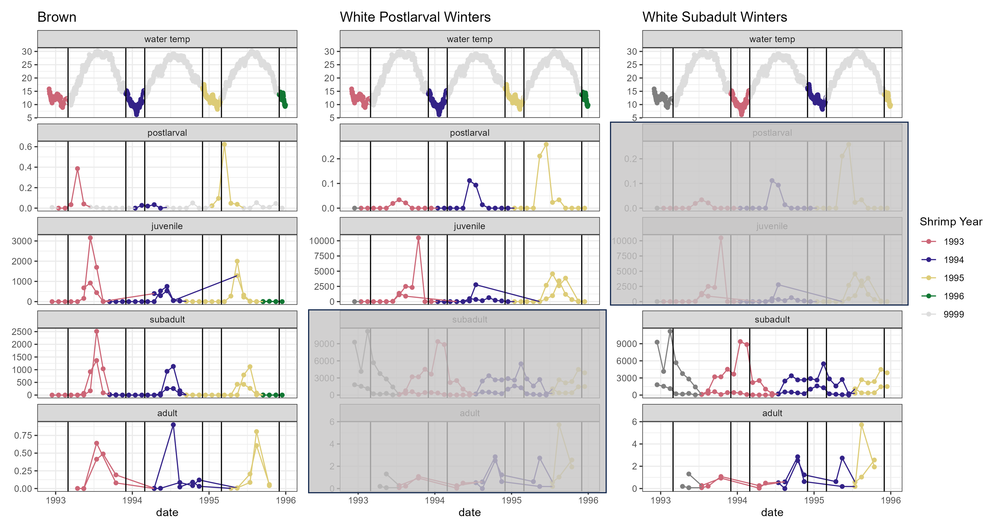

# Shrimp Year Abundance Index Explanation {#sec-shrimpyearexpl}

The concept of **shrimp year** is somewhat complicated - a detailed explanation is below. If you prefer, jump straight to @tbl-shrimpYearAssignment and/or @fig-wintershrimpyears.

```{r}
library(dplyr)
library(ggplot2)
library(patchwork)
library(tibble)
library(gt)
```

## Shrimp Year

When examining long-term datasets, it is convenient, if not necessary, to perform some aggregation of data to means or totals over some representative length of time (e.g. monthly mean temperature, annual precipitation total, monthly or annual totals of money spent on \[anything related to budgets\]).

In this project, we want to be able to link different life stages of shrimp to each other, and ask questions like "if postlarvae did well this year, did juveniles also do well? does that hold all the way through adults, and fisheries landings?"

Animal life cycles, incoveniently for us, do not necessarily align with calendar years. It may be (and for brown shrimp generally is the case) that young are spawned early in a calendar year and are adults late in that calendar year. However, white shrimp (and many other species) may be spawned in the middle or late part of a calendar year, and not be adults until the next calendar year. So, in order to relate those adults to the earlier life stages, we cannot use calendar year to represent the cohort of shrimp.

We use **shrimp year** to represent a single cohort of shrimp, and assign the calendar year in which that group of shrimp will live most of their lives. For brown shrimp, the shrimp year is the calendar year in which the individuals will show up in the fishery. For white shrimp, it is the year in which they go through most life stages; though adults will bleed into (and spawn in) the following calendar year.

Each survey in this project, based on its location of sampling, is expected to primarily catch a single life stage of each shrimp. Based on the month of sampling, the targeted life stage, and the shrimp species, we assigned shrimp year to each sampling event based on the following:

### Table based on sample date and life stage  

**need to give it some formatting love, but this aligns with assignment**  

```{r}
#| label: tbl-shrimpYearAssignment
#| tbl-cap: "Shrimp year assignments, based on month and calendar year of sampling, by species and life stage. 'year' represents the calendar year of sample date. 'year - 1' represents the calendar year prior to the sample date (e.g. 2004 when sample date is 2005). 'year + 1' represents the calendar year after the sample date (e.g. 2006 when sample date is 2005)."

shrimp_table <- tribble(
  ~Month, ~BS_Postlarvae, ~BS_Juvenile, ~BS_Subadult, ~BS_Adult,
           ~WS_Postlarvae, ~WS_Juvenile, ~WS_Subadult, ~WS_Adult,
  "1 - Jan", "year", "year", "year", "year", "year", "year", "year - 1", "year - 1",
  "2 - Feb", "year", "year", "year", "year", "year", "year", "year - 1", "year - 1",
  "3 - Mar", "year", "year", "year", "year", "year", "year", "year - 1", "year - 1",
  "4 - Apr", "year", "year", "year", "year", "year", "year", "year - 1", "year - 1",
  "5 - May", "year", "year", "year", "year", "year", "year", "year - 1", "year - 1",
  "6 - Jun", "removed", "year", "year", "year", "year", "year", "year - 1", "year - 1",
  "7 - Jul", "removed", "year", "year", "year", "year", "year", "year", "year",
  "8 - Aug", "removed", "year", "year", "year", "year", "year", "year", "year",
  "9 - Sep", "removed", "year + 1", "year + 1", "year", "year", "year", "year", "year",
  "10 - Oct", "removed", "year + 1", "year + 1", "year", "year", "year", "year", "year",
  "11 - Nov", "removed", "year + 1", "year + 1", "year", "year", "year", "year", "year",
  "12 - Dec", "removed", "year + 1", "year + 1", "year", "year", "year", "year", "year"
)

# Step 2: Create the gt table
shrimp_table |> 
  gt() |> 
  tab_spanner(
    label = "Brown Shrimp",
    columns = BS_Postlarvae:BS_Adult
  ) |>
  tab_spanner(
    label = "White Shrimp",
    columns = WS_Postlarvae:WS_Adult
  ) |>
  cols_label(
    BS_Postlarvae = "Postlarvae",
    BS_Juvenile = "Juvenile",
    BS_Subadult = "Subadult",
    BS_Adult = "Adult",
    WS_Postlarvae = "Postlarvae",
    WS_Juvenile = "Juvenile",
    WS_Subadult = "Subadult",
    WS_Adult = "Adult"
  ) 
```


### Environmental data

Winter temperatures and cold spells can impact shrimp growth and/or survival, and understanding these dynamics is important to shrimp fishery managers. Salinity during early life stages may also impact shrimp, and these effects extend to later stages of the life cycle.

Again, we need to aggregate data. **Winter** here is defined as December through February. For brown shrimp, the shrimp year impacted by winter temperatures is the calendar year containing that January and February. For white shrimp, we have assigned each winter metric separately to two life stages, as they occur in different years: postlarval winters and adult winters. Subadults and adults will be impacted by winter temperatures occurring a year after the winter temperatures that affect the postlarval and juvenile stages. See @fig-wintershrimpyears. **Nursery period** is defined separately for each species, based on Batchelder et al. 2024\*: April through July for brown shrimp, and June through October for white shrimp.

\*Batchelder, L., Stone, J., Kimball, M., Pfirrmann, B., & Dunn, R. (2024). Phenology of penaeid shrimp nursery habitat use: Trends and environmental drivers over four decades. Marine Ecology Progress Series, 751, 79–95. https://doi.org/10.3354/meps14741

## Graphic of abundances, temperatures, and assigned shrimp years

**this will be what Kim showed the group at some point in the past, with 2 or 3 calendar years worth of data**

**need to actually process the data though** and use quarto's `embed` functionality to show it here  

{#fig-wintershrimpyears width="9.43in"}

**group may want to insert conceptual diagram too when that is completed**

## Abundance Index

This project brought together a number of surveys by different organizations, with different methods, and different ways of quantifying shrimp abundance. In order to make these numbers comparable, while accounting for possible variation in the number of sampling stations and sample dates over time, we have adjusted abundance metrics to an index using the following steps. More details for individual datasets will be provided in that life stage's chapter in the "Summarizing to Abundance Index" portion of this book.

For each survey:

1.  Assign shrimp year to each sample, based on month and species.  
2.  If a sampling event (site/station on a date) had replicates, average them.  
3.  Average data across all sites/stations on a sample day.  
4.  Average data across all sampling dates within each month = average abundance for the month.  
5.  Add the monthly averages, to get a total abundance for each shrimp year. This absorbs variability in timing for a year.  
6.  From total abundance per shrimp year, derive an index:  

    a.  Take the square root of total abundance (deals some with extreme high numbers).  
    b.  Mean-center the result from (a) across all shrimp years for the dataset.  
    c.  Divide by the standard deviation across all shrimp years for the datset.


## About

**Input `.qmd` file** for this section was:  **`r xfun::with_ext(knitr::current_input(), "qmd")`**  and can be found in the main directory.  
